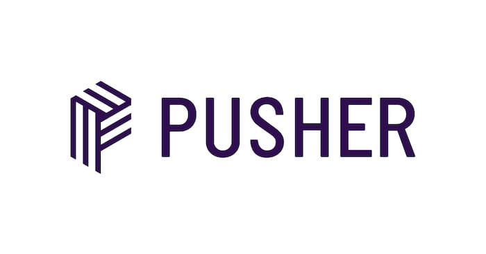

# Movie Quotes

"Movie Quotes" helps people to share interesting movie quotes with each other, application can be split on four main parts: Landing, Profile, Newsfeed and Movie List pages.
##### Landing Page
Guest can register or login with custom authorization system or with help of Google OAuth API.
##### Profile     
There are two variations of profile, Google users can change their profile image or username, on other hand, regular users can change their profile image, username, password and even Email address.
##### Newsfeed
This page is where applications main functionality unifies with each other, where quotes can be seen or added as posts, users can interact via likes and comments, these can be transformed into notifications in real time, posts can be searched with their quotes or movie names.
##### Movie List
This page is a connecting bridge between users and application functionality, because only from here is possible to add movies and many other things too.

#### Application supports English and Georgian languages.

#
### Table of content

1. [Introduction](#Introduction)
2. [Prerequisites](#Prerequisites)
3. [Tech Stack](#Tech-Stack)
4. [Getting Started](#Getting-Started)
5. [Deployment](#Deployment)

#
### Prerequisites

*  *npm@6 and up*
*  *VITE@3.0 and up*


#
### Tech Stack

*  [Vue@3.2.38.x](https://vuejs.org/) - front-end framework
*  [Vee-validate@4.x](https://vee-validate.logaretm.com/v4/) - package for form validation
*  [Pinia@2.0.21.x](https://pinia.vuejs.org/) - package for storage
*  [Tailwind css@3.1.8.x](https://tailwindui.com/) - package for styling 
*  [Pusher@7.5.0.x](https://pusher.com/) - package for real time notifications


#
### Getting Started
1\. First of all you need to clone 'epic-movie-quotes-nugzar-skhiereli' repository from github:
```sh
git clone https://github.com/RedberryInternship/epic-movie-quotes-nugzar-skhiereli.git
```

2\. After you have installed all the PHP dependencies, it's time to install all the JS dependencies:
```sh
npm install
```

3\. Compile and Hot-Reload for Development

```sh
npm run dev
```

4\. Compile and Minify for Production

```sh
npm run build
```

5\. Lint with [ESLint](https://eslint.org/)

```sh
npm run lint
```


##### Now, you should be good to go!


#
### Deployment
<br/>


<br />

- Projects first step is of course is development.
 After some time of development when you are ready to integrate and deploy your feature/fix/work you start doing these actions:
* Installing tools and programs on the server.
* Downloading the Laravel project to the server.
* PHP FPM configuration.
* NGINX configuration.
* Setting up SSL with LetsEncrypt.

After these steps everything should be OK :pray: